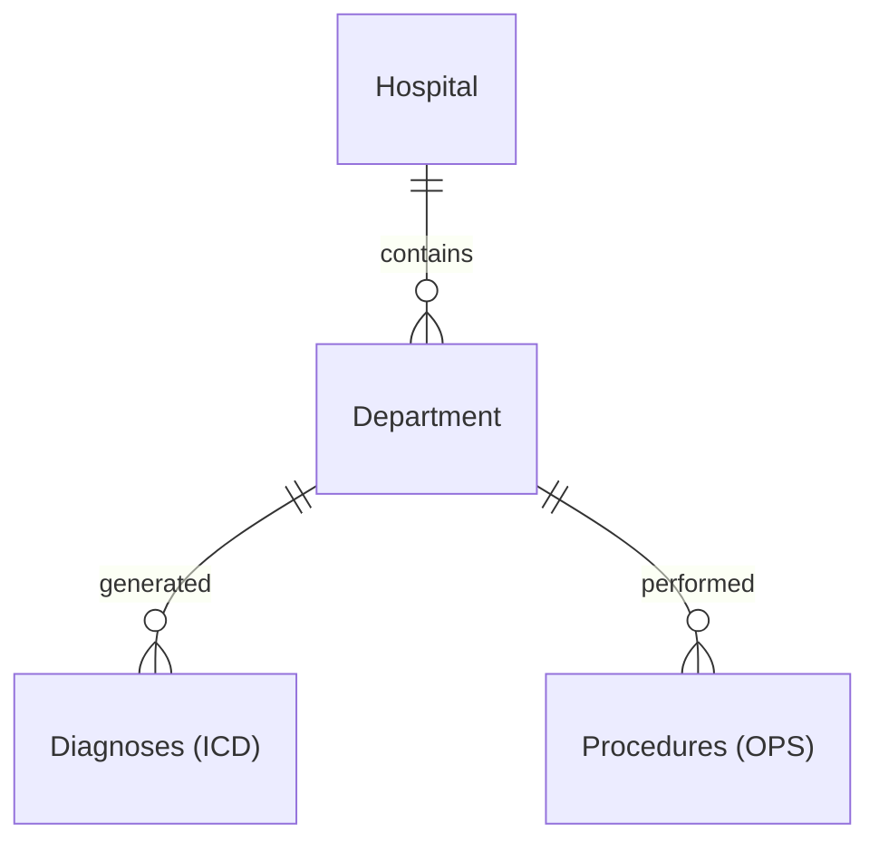

# Data: Hospitals

## Goal

Obtain a third dataset containing multidimensional data about hospitals in Germany.

## Where to get the data?

The dataset is available from the health ministry on request. You need to fill out the data order form on the homepage of the **Gemeinsamer Bundesausschuss** [qb-referenzdatenbank.g-ba.de/#/login](https://qb-referenzdatenbank.g-ba.de/#/login).
The data is public so it is a formality and generally shall be approved. Click **"No"** in the field asking whether you are planning to redistribute the data. The order should be processed within 1-2 working days.

> **Note:** Please coordinate. It is not necessary that all of you send separate orders (they are reviewed manually).

> **Warning:** The data is public and may be used freely, but it **must not be redistributed under any circumstances**.

## What does the data contain?

Once you download and unzip the dataset, you should have a folder with many XML files.
These XML files contain all hospitals, units, diagnoses and treatments.
They also contain tons of other stuff that you don't need.
The main structure is this:

## How to preprocess XML data?

XML is an ugly format that should have retired long ago.
I recommend converting everything to JSON/dictionaries first.
Consider using the **xmltodict library** ([github.com/martinblech/xmltodict](https://github.com/martinblech/xmltodict)).

You may want to understand the structure of the files a bit. There is a lot of information we do not need. Please focus on:

- we only need the `.xml.xml` files
- each files represents a **hospital location** (some may have the same name but different addresses)
- each **hospital location** has one or more **units (Fachabteilungen)**
- each **unit** documents one or more **diagnoses** represented by ICD codes. Some have a number, some are empty because of data protection.
- each **unit** documents one or more **procedures** represented by OPS codes. Some have a number, some are empty because of data protection.
- each **hospital location** has one main address

I recommend ignoring everything else. There are details that matter, but we should leave those to domain experts.
