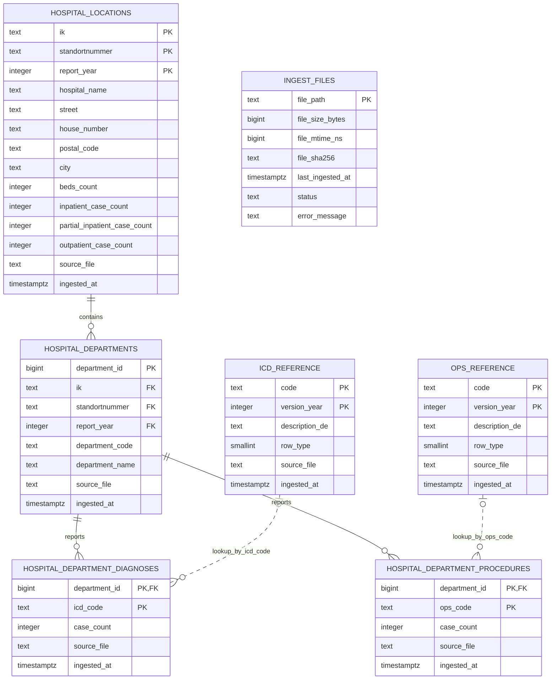

# Database ER Diagram

This diagram reflects the schema currently defined in `ingest/schema.py`.

## Relationship Notes

- `hospital_locations` uses a composite primary key: `(ik, standortnummer, report_year)`.
- `hospital_departments` belongs to one hospital location through that same composite key.
- `hospital_department_diagnoses` and `hospital_department_procedures` belong to one department via `department_id`.
- `icd_reference` and `ops_reference` act as lookup tables for code metadata.
- The current schema does **not** declare foreign keys from `hospital_department_diagnoses.icd_code` to `icd_reference.code` or from `hospital_department_procedures.ops_code` to `ops_reference.code`, so those links are logical relationships rather than enforced constraints.
- `ingest_files` is operational metadata for tracking ingested source files and is not directly connected by foreign keys to the domain tables.
